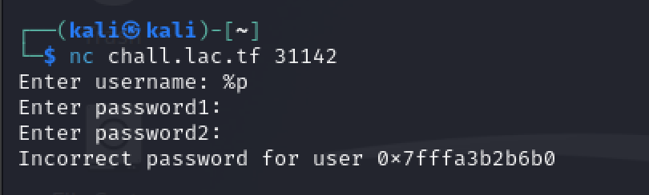
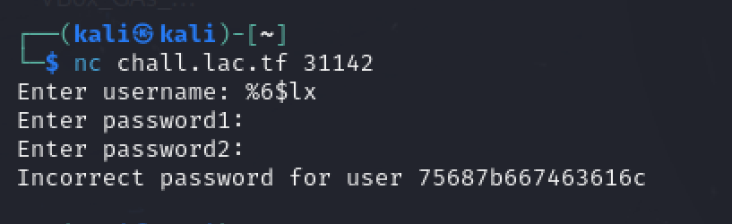
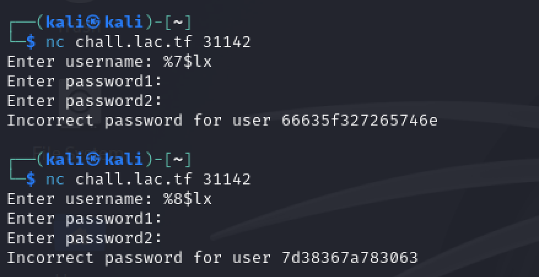

## pwn/2password -- kaiphait

2Password > 1Password

```nc chall.lac.tf 31142```

## Solution

Along with the server used to interface with the challenge, a series of files including the challenge excecutable, a docker file, some dependencies, and the below c file were included.
```c
#include <stdio.h>
#include <stdlib.h>
#include <string.h>

void readline(char *buf, size_t size, FILE *file) {
  if (!fgets(buf, size, file)) {
    puts("wtf");
    exit(1);
  }
  char *end = strchr(buf, '\n');
  if (end) {
    *end = '\0';
  }
}

int main(void) {
  setbuf(stdout, NULL);
  printf("Enter username: ");
  char username[42];
  readline(username, sizeof username, stdin);
  printf("Enter password1: ");
  char password1[42];
  readline(password1, sizeof password1, stdin);
  printf("Enter password2: ");
  char password2[42];
  readline(password2, sizeof password2, stdin);
  FILE *flag_file = fopen("flag.txt", "r");
  if (!flag_file) {
    puts("can't open flag");
    exit(1);
  }
  char flag[42];
  readline(flag, sizeof flag, flag_file);
  if (strcmp(username, "kaiphait") == 0 &&
      strcmp(password1, "correct horse battery staple") == 0 &&
      strcmp(password2, flag) == 0) {
    puts("Access granted");
  } else {
    printf("Incorrect password for user ");
    printf(username);
    printf("\n");
  }
}

```

Taking a look at the above code yields really only one clear path towards the solution. At the end of the program once the user has failed the password checks, the program will then print the supplied username to the screen with *zero* santizing. 

This leaves the program open to a string formatting attack via printf()


This can be easily tested by connecting to the server and setting the username to something immediately obvious such as **%p** which causes printf to output the memory address of a given variable.



lo and behold it works! Thus proving that this program is indeed vulnerable to a formatting attack.

Notably, printf accepts special formatting strings such as **%1**, **%2**, etc. that allow the user to pass in different variables. However if no variables are passed in while the formatting strings are still there, it starts pulling data off the stack and printing it willy nilly. Because of this, we can systematically retrieve data until we reach something that seems to be the ```char flag[42]``` that we're looking for.

Since the data being printed is going to be in hex, encrypting "lactf{" into "6C 61 63 74 66 7B" ahead of time makes finding the flag within the stack a lot easier. 

After trying each "argument" one by one (%1, %2, %3, ...) the 6th argument seems to be promising.



75 68 7b 66 74 63 61 6c decodes into "uh{ftcal" so it seems like the flag could be reversed and broken up into multiple different segments. After poking around some more, the 7th and 8th "arguments" yield the other pieces of the flag!



These each decode to "fc_2retn" and "}86zx0c" respectively. Reversing each string and concatenating them all together reveals the final flag:

```
lactf{hunter2_cfc0xz68}
```
---
