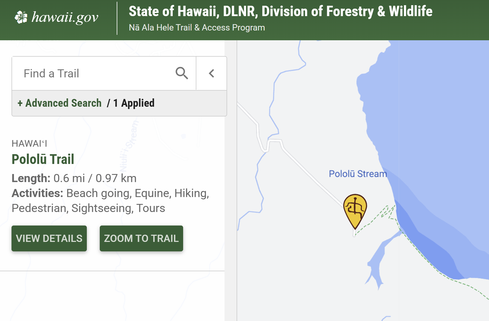
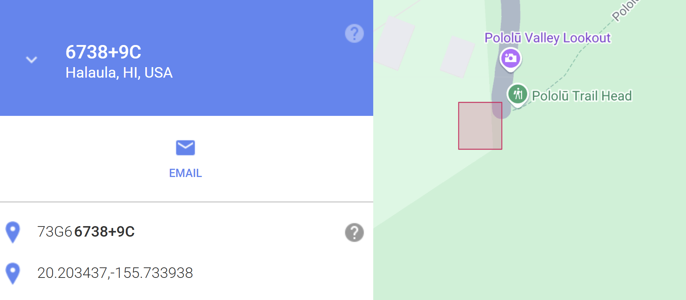

## misc/Danger Searching -- burturt
My friend told me that they hiked on a trail that had 4 warning signs at the trailhead: Hazardous cliff, falling rocks, flash flood, AND strong currents! Could you tell me where they went? They did hint that these signs were posted on a public hawaiian hiking trail.

Note: the intended location has all 4 signs in the same spot. It is 4 permanent distinct signs - not 4 warnings on one sign or on a whiteboard.

Note: Feel free to try multiple plus codes. The answer skews roughly one "plus code tile" south/west of where many people think it is.

Flag is the full 10 digit [plus code](https://plus.codes/map) containing the signs they are mentioning, (e.g. lactf{85633HC3+9X} would be the flag for Bruin Bear Statue at UCLA). The plus code is in the URL when you select a location, or click the ```^``` at the bottom of the screen next to the short plus code to get the full length one. If your plus code contains 3 digits after the plus sign, zoom out and try selecting again.

## Solution

The most useful hint for this is that it was on a public Hawaiian hiking trail. 
Lucky for us, the government of Hawaii has an online datbase with varying search filters to help narrow it down.
https://hawaiitrails.ehawaii.gov/trails/#/

Filtering by the four hazards listed in the clue, only the **Pololū Trail** matches this description. 



Clicking "View Details" and then "Get Directions" pulls up the resulting location on google maps where we can confirm via street view it is indeed the location we are looking for!


The challenge description gives a link to the google plus code website which, if we plug in the location of the trailhead allows us to click around the area and test various plus codes. 

In the end, the solution plus code is a little to the left of the trailhead which required some trial and error to uncover.



```
lactf{73G66738+9C}
```
