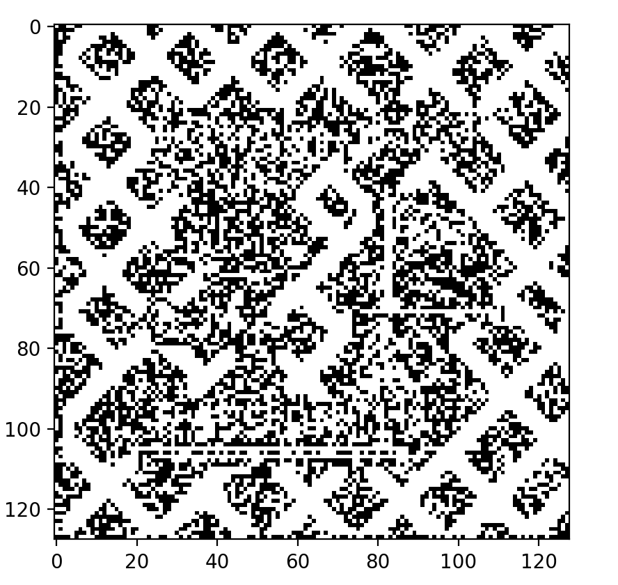
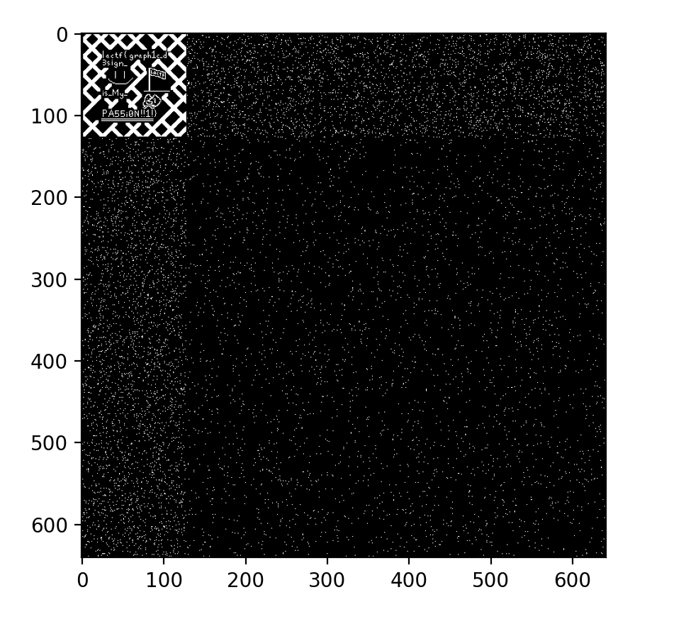
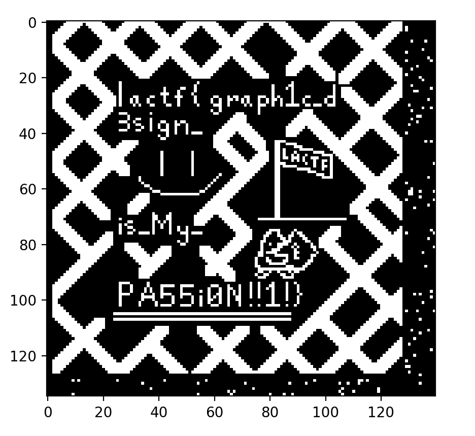

## misc/not-just-a-hobby -- ryan

It's not just a hobby!!!

## Solution

The included download is a Verliog file in the form:

```
module v (
	input [6:0] x,
	input [6:0] y,
	output reg [3:0] vga_r,
	output reg [3:0] vga_g,
	output reg [3:0] vga_b
);

	always @(*) begin
		if ((x == 7'd588 && y == 43) || (x == 482 && y == 7'd513) || (x == 7'd279 && y == 617) || ...

		...

        ... || (x == 7'd508 && y == 7'd515) || (x == 326 && y == 213) ||
		(x == 429 && y == 392)) begin
			vga_r = 4'h0;
			vga_g = 4'h0;
			vga_b = 4'h0;
		end
	end
endmodule
```

From what's availible it's pretty easy to deduce that the program takes coordinates from two input busses, then outputs a color, either black or white, to those screen coordinates via the three vga output busses. 

Some interesting things to note: 
* The input bus is only 7 bits wide allowing a maximum input value of 127.
* Certain coordinates have the prefix ```7'd``` which truncates the following value to 7 bits
* Many of the input values extend beyond 128 with a maximum of 640


Disregarding the odd selection of certain truncated values, let's just take this script at face value and pretend it's running on original hardware. I wrote up a quick python script that reads in the verilog file, filtering it through a regular expression to pull out all of the coordinates before rendering the result to the screen.



Well evidently theres something there. Now honestly it just took some fiddling around but eventually I decided to completely ignore the bus with of 7 bits and explore a hypothetical where the screen size was 640 by 640 instead. I'm still going to truncate the special values as it's likely that was intentional. Doing so and plotting it to the screen results in this:





Lo and behold! We have our flag.

```lactf{graph1c_d3sign_is_My_PA55i0N!!1!}```

---

<details>
	<summary>Solver script for anyone interested</summary>
	(Added a -u cla to easily toggle between 128x128 and 640x640)
	```
	import numpy
import matplotlib.pyplot as plt
import re

fname = input("file: ")
mode = input("mode: ")
compress = True
if(mode == "-u"):
    compress = False

pattern = re.compile(r"\(x.*?(.{3})(\d+) && y.*?(.{3})(\d+)\)") # expression to extract coordinates

with open(fname) as f:
    code = f.read()

pixels = []
special_pixels = []

for match in re.finditer(pattern, code):
    p1 = []
    special = False
    if(match.group(1) == "7'd"): # separating these to a different array for processing
        p1.append(int(match.group(2)))
        special = True
        p1[0] &= 0x7f
    else:
        p1.append(int(match.group(2)))
        if (compress):
            p1[0] &= 0x7f
    if (match.group(3) == "7'd"): # separating these to a different array for processing
        p1.append(int(match.group(4)))
        special = True
        p1[1] &= 0x7f
    else:
        p1.append(int(match.group(4)))
        if (compress):
            p1[1] &= 0x7f
    if(special == True):
        special_pixels.append(p1)
    else:
        pixels.append(p1)

#pixels += special_pixels

if(compress == True):
    image_data = numpy.zeros((128, 128), dtype=numpy.uint8)
else:
    image_data = numpy.zeros((641, 641), dtype=numpy.uint8)

for p in pixels:
    image_data[p[1]][p[0]] = 255
for p in special_pixels:
    image_data[p[1]][p[0]] = 255


plt.imshow(image_data, cmap='gray', vmin=0, vmax=255)
plt.show()
	```
</details>